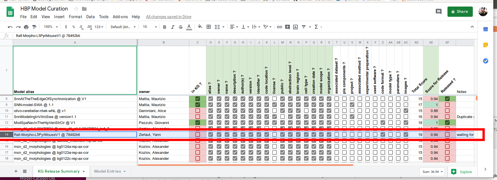
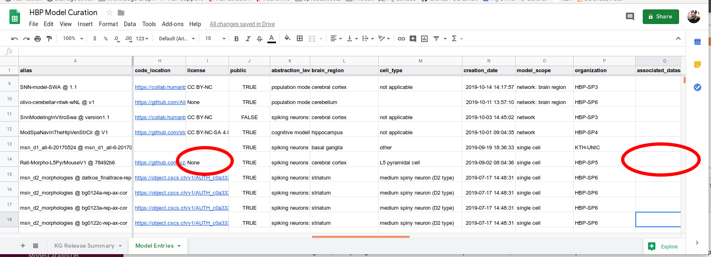
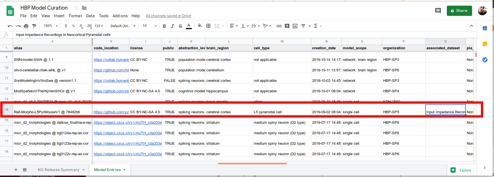
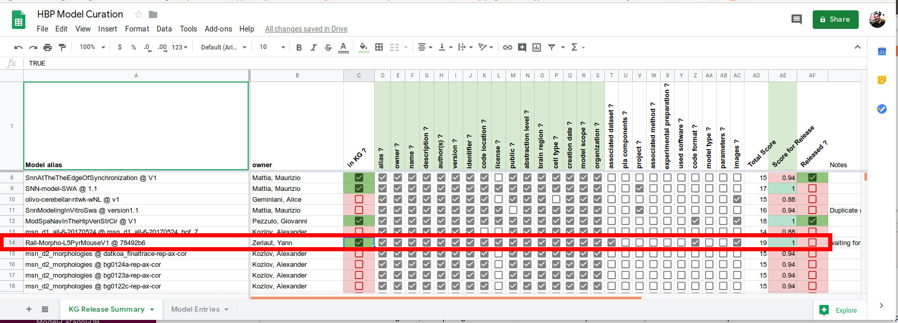
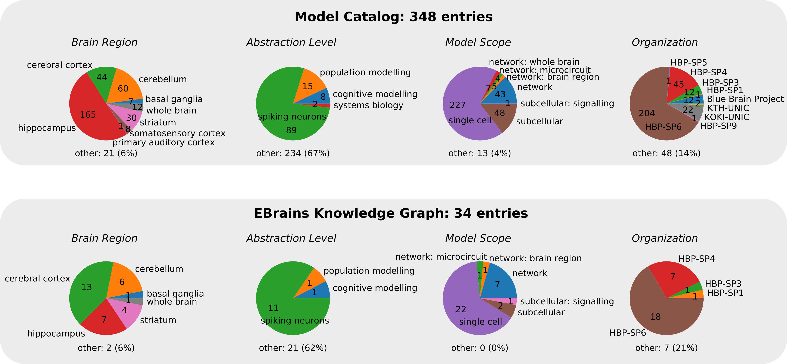

# Model curation 

**A python module for the model curation process in the HBP.**

It details the pipeline applied to *Model* entries from their submission in the [Model Catalog](https://collab.humanbrainproject.eu/#/collab/19/nav/369318?state=model.n) (by the HBP contributors) to their publications in the [EBRAINS Knowledge Graph Search](https://kg.ebrains.eu/search). 

## Model curation in context

Curation is the process of organising and integrating data into a collection by gathering and structuring metadata. This requires to insure the use of a "common language" for referencing metadata and to ensure a high quality of metadata. In the present context of neuroscientific models, we want to reference models by using a metadata management tool for neursocientific research: the [EBRAINS Knowledge Graph](https://kg.ebrains.eu/search). The model curation process should also insure that the release of models comply with the [FAIR](https://www.go-fair.org/fair-principles/) principles of data sharing (Findability, Accessibility, Interoperability, Reusability).

## Schematic of the curation pipeline

The curation process includes automatic processes of database updates together with manual editing of entries and email/tickets interactions with the model contributors. 

The curation pipeline is depicted in the following schematic:


## Installation and environment setup
### Installing dependencies

You can install the dependencies of this module by running:

```
pip install -r requirements.py
```

The dependencies include:

1. Some python modules of the Human Brain Project ecosystem:

	- [fairgraph](https://github.com/HumanBrainProject/fairgraph): A high-level Python API for the HBP Knowledge Graph
	- [hbp-validation-client](https://github.com/HumanBrainProject/hbp-validation-client)
	- [hbp-validation-framework](https://github.com/HumanBrainProject/hbp-validation-client): A Python package for working with the Human Brain Project Model Validation Framework.

2. The Python API to work with Google Spreadsheets:

   - [Google Spreadsheet API](https://developers.google.com/sheets/api). Follow the instructions to get the credentials at: https://developers.google.com/sheets/api/quickstart/python

### Installing the `model-curation` module

Clone the repository:

```
git clone https://github.com/yzerlaut/model-curation.git
```

### Setting up your environmment

Fill the following file (`env_variables.py`) with the credentials of the validation framework and the informations related to you installation (ask for the ):
```
import os

# location of your json files for the HBP logins
hbp_token_file=os.path.join(os.path.expanduser("~"), "Downloads", "HBP.json") 
hbp_storage_token_file=os.path.join(os.path.expanduser("~"), "Downloads", "config.json")

# location of your hbp-validation-framework repository
validation_framework_path = os.path.join(os.path.expanduser("~"), "work", "hbp_validation_framework")
# credentials required to fetch informations from the PostgreSQL database of the Model Catalog
VALIDATION_FRAMEWORK_INFOS = {    
    "DJANGO_SECRET_KEY":"'...'",
    "HBP_OIDC_CLIENT_ID":"...",
    "HBP_OIDC_CLIENT_ID":"...",
    "HBP_OIDC_CLIENT_SECRET":"...",
    "HBP_OIDC_CLIENT_SECRET":"...",
    "VALIDATION_SERVICE_PASSWORD":"...",
    "VALIDATION_SERVICE_HOST":"...",
    "VALIDATION_SERVICE_PORT":"...",
}

# ID of Google Spreadsheets
SPREADSHEETS_ID = {
    "MODEL_CURATION_SPREADSHEET":"...",
    "MODEL_CURATION_SPREADSHEET_PREVIOUS":"...",
    "SGA2_SP6_SPREADSHEET_ID" :"...",
    "SGA2_SP3_SPREADSHEET_ID" : "...",
}
```

Note that this assumes that you save the token obtained at https://nexus-iam.humanbrainproject.org/v0/oauth2/authorize in your Download folder as `HBP.json` (default settings). Similarly, the storage token obtained at https://validation-staging.brainsimulation.eu/config.json should be saved as `config.py` in the Download folder.

## Environment (loading necessary bash variables)

run the =setting_env_variables.sh=  script in the shell 

```
source setting_env_variables.sh
``` 

This should output something like:
```
-----TOKENS -------------------
[ok] the new HBP token is eyJhbGciOi...uH41znzh-Y
[ok] the new CSCS token is eyJhbGciOi...QYRSFb_sSg
-----SPREADSHEET -------------------
[ok] MODEL_CURATION_SPREADSHEET
[ok] MODEL_CURATION_SPREADSHEET_PREVIOUS
[ok] SGA2_SP6_SPREADSHEET_ID
[ok] SGA2_SP3_SPREADSHEET_ID
-----VALIDATION FRAMEWORK INFOS -------------------
[ok] DJANGO_SECRET_KEY
[ok] HBP_OIDC_CLIENT_ID
[ok] HBP_OIDC_CLIENT_SECRET
[ok] VALIDATION_SERVICE_PASSWORD
[ok] VALIDATION_SERVICE_HOST
[ok] VALIDATION_SERVICE_PORT
``` 

You should should be set up !

## Curation steps

We detail below the different steps composing the curation pipeline (see above schematic for their numbering).

### 1) Fetching data from the Model Catalog app

Steps performed: 

- We fetch the informations from the PostgreSQL database of the Model Catalog app, with:

```
python update_DB.py Fetch-Catalog
```

- We transform the "model-based" set of entries in the Model Catalog to a "version-based" set of entries, with:

```
python update_DB.py Catalog-to-Local
```

- We search in the Knowledge Graph for the UUID (thanks to =fairgraph=) of the provided entries of all fields in the model (when possible). We associate all entries to this `UUID` in the local database). This is done on a single model basis with:

```
python update_DB.py Add-KG-Metadata-to-Local --SheetID 14
```
You can loop over entries by using the `--SheetID_range` argument:
```
python update_DB.py Add-KG-Metadata-to-Local --SheetID_range 2-300
```

----------------------------------------------------------------
Note that this only happens new models to the Local database, it doesn't rewrite the full local database. If you want to (re)-start from scratch from the information contained in the Model Catalog, use:
```
python update_DB.py Catalog-to-DB-full-rewriting
```

If you want to restart from scratch while keeping your manual updates of the entries (i.e. the modifications resulting from the interactions with the users done in *Step 5*) **TO BE IMPLEMENTED**
```
python update_DB.py Catalog-to-DB-full-rewriting-with-stored-changes
```

N.B. If the model is released in the KG and the "version name" does not match any of the version name found in the Catalog. Assuming that their is only one version (what is the case), for the "version name" in the LocalDB, we take the one of the KG not of the Catalog. This only happens for this set of models: (https://kg.ebrains.eu/search/?q=granule&facet_type[0]=Contributor#Contributor/2c916596118aa1ae6070497dae75dda2)

### 2) Writing the local DB on the spreadsheet

We use the Google API to write the Local database to the model spreadsheet
```
python update_DB.py Local-to-Spreadsheet
```
This will update both the *Model Entries* and the *KG Release Summary* sheets of the spreadsheet.

### 3) Visualize metadata and find missing information

This is done by visualizing the two sheets of the Google Spreadsheet (you can get the url of the spreadsheet by typing in the shell `echo $curation_url`, this was loaded by the `setting_env_variables.sh` script).

Let's take the example of an entry that needs to be curated. On the spreadsheet shown below, the entry of alias `Rall-Morpho-L5PyrMouseV1 @ 78492b6` (that has a `SheetID==14`) lacks a `license` term (in the required fields for KG release, highlighted in green at the top), we will therefore needs the model producer (here `Yann Zerlaut`) to provide one.



We also note that there is a few non-mandatory fields that are missing (`associated_dataset`, `used_software`, ...), so we will ask the model producer to confirm that such metadata are irrelevant to the study.

### 4) Interact with model producers to fix missing fields


We interact with the model producer through emails or tickets on the [Zammad platform](https://support.humanbrainproject.eu/#ticket/view/my_tickets) (if he created one at submission time). The information collected was the following:

- the license term that should apply to this entry is 
- there is indeed a dataset relevant to that study, a set of intracellular recording was used to constraint this numerical model. Those data were submitted as a `Dataset` to the Knowledge graph (if it didn't, it should). The name and identifier of that Knowledge Graph `Dataset` entry are: `name="Input Impedance Recordings in Neocortical Pyramidal cells"` and `UUID="5a95ceb4-e303-42e3-9558-83b9ccb45976"`

We therefore want to update the two following missing fields:


### 5) Update the entries

We fix the entries manually in the Local database using a command-line tool. The tool works on a entry-by-entry basis for a `python update_DB --SheetID <ID> --key <KEY> --value <VALUE>`, not that `<VALUE>` can be either a name or an UUID in the Knowledge Graph.

For the example above, we run:
```
python update_DB --SheetID 14 --key license --value "CC BY-NC-SA 4.0"
python update_DB --SheetID 14 --key associated_dataset --value "Input Impedance Recordings in Neocortical Pyramidal cells"
```
N.B. For the fields that support multiple entries, you can add multiple values in series, e.g. `--value "Name 1" "Name 2" "Name 3"`

We check the Knowledge Graph metadata for those entries with `Add-KG-Metadata-to-Local` (see *Step 2*) and we update the spreadsheet:
```
python update_DB.py Add-KG-Metadata-to-Local --SheetID 14
python update_DB.py Local-to-Spreadsheet
```

Note that if some metadata entries are not already present in the Knowledge Graph (e.g. `model_scope`, `cell_type`, ...), it should be manually created using the [Knowledge Graph Editor](https://kg-editor.humanbrainproject.eu/). Once all metadata information do exist in the Knowledge Graph, re-run the above command `Add-KG-Metadata-to-Local` to insure the cross-linking to Knowledge Graph entries.

You can now visualize the result in the *Model Entries* sheet:


And in the *Release Summary* sheet:


### 6) Write to Knowledge Graph

Now that we have insured that all metadata were accurate and had a correspondance in the Knowledge Graph, we can create the new `ModelInstance` entry in the Knowledge graph with:

```
python update_DB Local-to-KG -sid 14 # "-sid" is the shortcut for "--SheetID"
```

This command invites you to review the model entry. If everything is fine, you can validate the submission.

```

{'KG_id': 'https://nexus.humanbrainproject.org/v0/data/uniminds/core/modelinstance/v1.0.0/a8b0d44a-267d-4cd5-b205-eee5c052603f',
 'KG_identifier': '0aa891e0b9eb7f88d76acad0925352717dbd0c2a',
 'abstraction_level': ('spiking neurons',
                       '33cd7f9e-0f6e-46af-8a55-1e3fbebbb0f0'),
 'alias': 'Rall-Morpho-L5PyrMouseV1 @ 78492b6',
 'associated_dataset': [('Input Impedance Recordings in Neocortical Pyramidal '
                         'cells',
                         '5a95ceb4-e303-42e3-9558-83b9ccb45976')],
 'associated_experimental_preparation': [],
 'associated_method': [],
 'author(s)': [('Zerlaut, Yann', 'd7db810e-57e4-49f3-9cde-a3e03458ffa5'),
               ('Destexhe, Alain', '79e451c0-59f6-425b-a336-9c8e7955aefa')],
 'brain_region': ('cerebral cortex', '7e397000-243c-4773-9cbe-00167dfc384d'),
 'cell_type': ('L5 pyramidal cell', '044d28e0-46fa-4104-aee2-ca3d7d50e03e'),
 'code_format': ('NEST-Python', '112c4aca-f193-421b-a1dc-047769538ef4'),
 'code_location': 'https://github.com/yzerlaut/diverse_coupling_to_synaptic_activity',
 'creation_date': '2019-09-02 08:04:36',
 'description': 'Neocortical processing [...] couple to local network \n'
                '78492b6',
 'identifier': 'b0aaf1f5-9c3a-4d2b-ad94-5b06296b4066',
 'images': [{'caption': "Estimating  the parameters of Rall's morphology model "
                        'from Input Impedance measurements',
             'url': 'https://raw.github.com/yzerlaut/diverse_coupling_to_synaptic_activity/master/figures/fig2_demo.png'}],
 'in_KG': 'True',
 'license': ('CC BY-NC-SA 4.0', '8462091d-45a0-4e57-a9cc-869a667d8702'),
 'model_scope': ('single cell', '3f85ad0d-71d4-4068-aa4a-b36bf4f06b27'),
 'model_type': ('', ''),
 'name': 'Rall Morphology Model for Layer 5 Pyramidal Cells in Mouse V1',
 'organization': ('HBP-SP5', ''),
 'owner': ('Zerlaut, Yann', 'd7db810e-57e4-49f3-9cde-a3e03458ffa5'),
 'parameters': 'None',
 'pla_components': ('None', ''),
 'project': ('None', ''),
 'public': 'True',
 'released_in_KG': 'False',
 'timestamp': '20190902080436',
 'used_software': [],
 'version': '78492b6'}
===========================================================
  the entry *can* be pushed to the Knowledge Graph
    please review the above information carefully
===========================================================
are you sure that the above informations are correct ? y/[n]
```

### 7) Release models in the KG

If a model passes all criteria and the authors wants it to be published. Go the [Knowledge Graph Editor](https://kg-editor.humanbrainproject.eu/), search for the desired entry using the "filter" tool. Use the "release" button (shape of a cloud) to release the model.

After the release in the [Editor](https://kg-editor.humanbrainproject.eu/), you can update the release status in the *Release Summary* sheet with:
```
python update_DB Release-Summary
```

## Rationale behind the pipeline

### Transformation from a "model-based" set of entries (in the Model Catalog) to a "version-based" set of entries

The Model Catalog database considers entries which are conceptual models that can have evolving implementation over time. On the other hand, the Knowledge Graph only considers specific model instances with a well-defined implementation that can be potentially released (and therefore should be ).

The chosen approach therefore duplicates a model across all its versions in the Knowledge Graph. A model with 10 versions in the Model Catalog will therefore have 10 ModelInstances in the Knowledge Graph.

## Model template

The metadata are stored as a tuple of strings (`name`, `UUID`), where =name= is a string identifyin the entry and `UUID` is the Knowledge graph identifier the name . Either "free" strings or strings corresponding to the UUID in the Knowledge Graph (e.g. the metadata related to the Person `Yann Zerlaut` has the UUID: `003beed8-1ee8-45ec-8737-785ca6239ef0`).

An empty template is stored in the =model_template.py= file. It reads:
```
template = {
    
    # Note that the order matters (it used for display in the Spreadsheets)
    "alias":"", # a string
    
    "version":"", # a string
    
    "owner":("",""), # a tuple of 2 strings
    
    "name":"", # a string

    "description":"", # a string
    
    "author(s)":[], # a set of tuples of 2 strings

    "identifier":"", # a string -> generated during model curation !

    "code_location": "", # a string

    "public":"", # a string either "TRUE" or "FALSE" (the inverse of private in the Model Catalog)
    
    # ------ KG METADATA -------- # 
    "abstraction_level":("",""), # a tuple of 2 strings
    "brain_region":("",""), # a tuple of 2 strings
    "cell_type":[], # a set of strings
    "creation_date":"", # a string
    "model_scope":("",""), # a tuple of 2 strings
    "model_type":("",""), # a tuple of 2 strings
    "organization":("",""), # a tuple of 2 strings
    "pla_components":("",""), # a tuple of 2 strings
    "project":("",""), # a tuple of 2 strings
    "associated_dataset":[], # a set of tuples of 2 strings
    "associated_method":[], # a set of tuples of 2 strings
    "associated_experimental_preparation":[], # a set of tuples of 2 strings
    "used_software":[], # a set of tuples of 2 strings
    "code_format": ("",""), # a tuple of 2 strings
    "license": ("",""), # a tuple of 2 strings
    "parameters": "", # a string
    
    # ------ IMAGES -------- # 
     "images":[], # list of dictionaries
    # elements of the "images" list should be of the form:
    # {"url":"",
    #  "caption":""}
}
```

## Configuration file

A file 

```
import os
# KEYS_FOR_MODEL_ENTRIES = [ # in the order you wish it to appear on the sheet !!
#     "alias", "owner", "name", "description", "author(s)", "identifier", 
#     "versions", "code_location", "private",
#     "abstraction_level", "brain_region", "cell_type",
#     "creation_date", "license", "model_scope", "model_type",
#     "organization", "pla_components", "project",
#     "associated_dataset", "associated_method",
#     "associated_experimental_preparation", "used_software",
#     "code_format", "license", "parameters", "images"
#

```

Same thing for the keys visibles in the /KG Release Summary/ sheet, it is now set by (in =src/spreadsheet_db.py=):

```
KEYS_FOR_RELEASE_SUMMARY = [s+' ?' for s in list(template.keys())[:2]]
KEYS_FOR_RELEASE_SUMMARY += ['Total Score', 'Score for Release', 'Released ?']
```

you can manually construct the list for the fields that you want to visualize. Of course, you will have to adapt the shape/visualization of the spreadsheet afterwards.

## Stats

Status of Model Curation (Nov. 20th):



A detailed and updated analysis of the model curation is available at:


## Backup system

At each operation (i.e. execution of the `update_DB.py` script), a backup of the local database is made. Backup files are stored in `db/backups/` as _pickle_ files with the format `**datetime**.pkl`.

```
ls db/backups/
```
gives:
```
_                        2019.11.18-16:27:01.pkl  2019.12.03-12:47:55.pkl  2019.12.03-18:15:19.pkl  Django_DB.pkl
2019.11.12-17:30:46.pkl  2019.11.19-11:48:54.pkl  2019.12.03-16:07:18.pkl  2019.12.11-10:29:17.pkl
2019.11.18-16:19:48.pkl  2019.11.19-11:49:18.pkl  2019.12.03-17:19:57.pkl  CatalogDB.pkl
```

Those backup files will accumulate and there will be the need to remove some of them over time. This can be performed with the command:

```
python db/clean_up_db.py 100
```

The last number indexes the number of backup files kept, default is `20`.


## ACKNOWLEDGEMENTS

All code is copyright 2019-2020 CNRS unless otherwise indicated.

<div></div>

This open source software code was developed in part or in whole in the Human Brain Project, funded from the European Union's Horizon 2020 Framework Programme for Research and Innovation under Specific Grant Agreements No. 720270 and No. 785907 (Human Brain Project SGA1 and SGA2).
