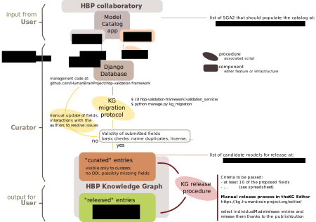

# Model curation process

A python module for the model curation process in the HBP. It curates entries from their submission in the Model Catalog to their publications in the HBP Knowledge Graph.

## Curation schematic (current pipeline)

## Dependencies

Two python modules of the Human Brain Project ecosystem:

-  A high-level Python API for the HBP Knowledge Graph
-  A Python package for working with the Human Brain Project Model Validation Framework.

The Python API for working with Google Spreadsheets:

- 

Follow the instructions to get the credentials at:

https://developers.google.com/sheets/api/quickstart/python

## Configuration file

