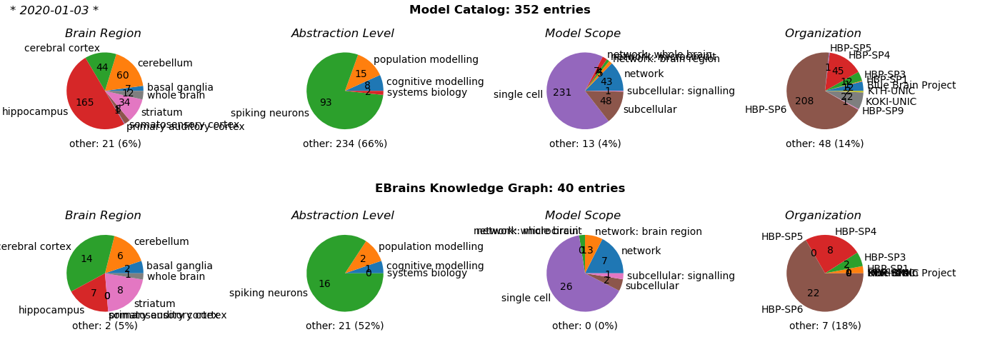

# Model curation stats

Here we analyze the metadata of the collection of models in both the [Model Catalog](https://collab.humanbrainproject.eu/#/collab/19/nav/369318?state=model.n) and the [EBRAINS Knowledge Graph Search](https://kg.ebrains.eu/search). 

## Current curation status

Update the status with `python stats/release_status.py`

## Other stats

### Authors

Update the status with `python stats/release_status.py`

### Custodians

### Custodians
